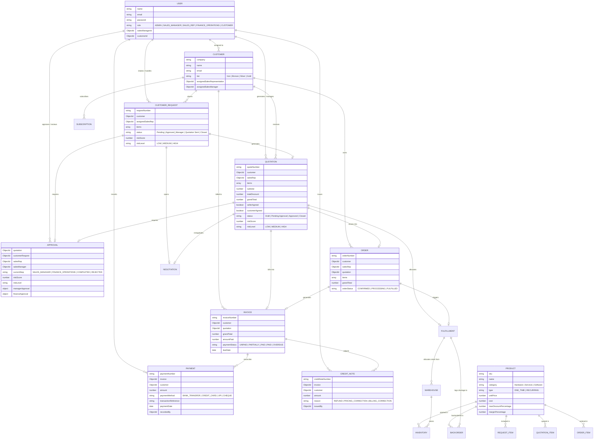
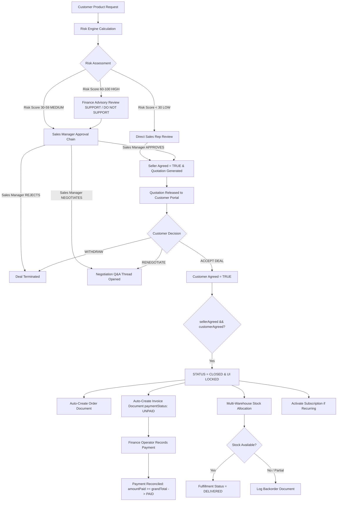

# 🏆 DealFlow360 — B2B Enterprise Deal Orchestration & Financial Control System

DealFlow360 is an enterprise-grade B2B Deal Orchestration, Rule-Based Governance, and Financial Control platform. It automates customer request intake, discount risk scoring, dynamic multi-tier approval workflows, dual-agreement deal closure, real-time negotiation Q&A, multi-warehouse stock allocation, subscription billing, and payment reconciliation.

---
# Demo Link: https://drive.google.com/file/d/1uY_KLtDZJe_3NiZUXGucWsiIyn-xY2kt/view?usp=sharing
## 📐 1. Entity-Relationship (ER) Diagram



---

## 🔄 2. End-to-End System Workflow



---

## 🧮 3. Mathematical Formulas Used

### 1. Blended Deal Risk Score Formula
Used in [`backend/src/services/riskEngine.js`](file:///c:/Users/vyomi/Music/DealFlow360/backend/src/services/riskEngine.js) to compute a weighted $0 - 100$ risk metric:

$$
\text{Risk Score} = \min\left(100, R_{\text{discount}} + R_{\text{margin}} + R_{\text{tier}} + R_{\text{volume}}\right)
$$

Where:
- **Discount Breach Component**:
  $$R_{\text{discount}} = \sum_{i \in \text{items}} \mathbb{I}(\text{disc}_i > L_i) \cdot \left( 20 + 1.5 \cdot (\text{disc}_i - L_i) \right)$$
  $$L_i = \min\left(\text{TierLimit}(\text{Customer.tier}), \text{CategoryLimit}(\text{Category}_i)\right)$$
- **Margin Protection Component**:
  $$R_{\text{margin}} = \sum_{i \in \text{items}} \mathbb{I}(\text{Margin}_i < 20\%) \cdot \left( 10 + 2 \cdot (20\% - \text{Margin}_i) \right)$$
- **Customer Tier Weight**:
  $$R_{\text{tier}} = \begin{cases} 15 & \text{Iron Tier} \\ 10 & \text{Bronze Tier} \\ 5 & \text{Silver Tier} \\ 0 & \text{Gold Tier} \end{cases}$$
- **Deal Volume Weight**:
  $$R_{\text{volume}} = \begin{cases} 10 & \text{Grand Total} \ge \text{₹}5,00,000 \\ 5 & \text{Grand Total} \ge \text{₹}2,50,000 \\ 0 & \text{Otherwise} \end{cases}$$

---

### 2. Deal Health Score Formula
Used in [`backend/src/services/dealIntelligenceService.js`](file:///c:/Users/vyomi/Music/DealFlow360/backend/src/services/dealIntelligenceService.js):

$$
\text{Health Score} = 0.30 \cdot S_{\text{velocity}} + 0.25 \cdot S_{\text{latency}} + 0.25 \cdot S_{\text{margin}} + 0.20 \cdot S_{\text{negotiation}}
$$

---

### 3. Quotation Financial Line Item & Tax Calculation
Used in [`backend/src/services/quotationGenerator.js`](file:///c:/Users/vyomi/Music/DealFlow360/backend/src/services/quotationGenerator.js):

$$\text{Final Unit Price}_i = \text{Unit Price}_i \cdot \left(1 - \frac{\text{Discount Percent}_i}{100}\right)$$
$$\text{Line Total}_i = \text{Final Unit Price}_i \cdot \text{Quantity}_i$$
$$\text{Subtotal} = \sum_{i} \text{Line Total}_i$$
$$\text{Tax} = \text{Subtotal} \cdot 0.18 \quad (18\% \text{ GST})$$
$$\text{Grand Total} = \text{Subtotal} + \text{Tax}$$

---

### 4. Payment Reconciliation & Dynamic Status Rule
Used in [`backend/src/controllers/financeController.js`](file:///c:/Users/vyomi/Music/DealFlow360/backend/src/controllers/financeController.js):

$$\text{Amount Paid} = \sum_{p \in \text{Payments}} \text{Payment.Amount}_p$$
$$\text{Remaining Balance} = \max\left(0, \text{Grand Total} - \text{Amount Paid}\right)$$

$$\text{Payment Status} = \begin{cases} \mathbf{PAID} & \text{if Amount Paid} \ge \text{Grand Total} \\ \mathbf{PARTIALLY\_PAID} & \text{if } 0 < \text{Amount Paid} < \text{Grand Total} \text{ and DueDate} \ge \text{now} \\ \mathbf{UNPAID} & \text{if Amount Paid} = 0 \text{ and DueDate} \ge \text{now} \\ \mathbf{OVERDUE} & \text{if Remaining Balance} > 0 \text{ and DueDate} < \text{now} \end{cases}$$

---

## 🔌 4. API Endpoints Reference

### Authentication & Users (`/api/auth`)
| Method | Endpoint | Description |
| :--- | :--- | :--- |
| `POST` | `/api/auth/login` | Authenticate user & issue JWT token |
| `GET` | `/api/auth/me` | Fetch authenticated user profile & role |
| `POST` | `/api/auth/forgot-password` | Request password reset OTP |
| `POST` | `/api/auth/reset-password` | Reset password using verified OTP |

### Customer Requests (`/api/customer-requests`)
| Method | Endpoint | Description |
| :--- | :--- | :--- |
| `GET` | `/api/customer-requests` | Fetch requests with RBAC scoping |
| `POST` | `/api/customer-requests` | Intake new product request & assign sales rep |
| `GET` | `/api/customer-requests/:id` | Fetch detailed request record |
| `POST` | `/api/customer-requests/:id/manager-action` | Sales Manager Approve/Reject/Negotiate action |
| `POST` | `/api/customer-requests/:id/finance-action` | Finance Operator advisory review (SUPPORT/DO_NOT_SUPPORT) |

### Quotations & Closure (`/api/quotations`)
| Method | Endpoint | Description |
| :--- | :--- | :--- |
| `GET` | `/api/quotations` | Fetch quotations directory |
| `GET` | `/api/quotations/:id` | Get single quotation detail |
| `POST` | `/api/quotations/:id/accept` | Customer accepts quotation (`customerAgreed = true`) |
| `GET` | `/api/quotations/closed-deals` | Fetch closed & finalized deals |

### Approvals (`/api/approvals`)
| Method | Endpoint | Description |
| :--- | :--- | :--- |
| `GET` | `/api/approvals` | Fetch pending approvals queue |
| `POST` | `/api/approvals/:id/action` | Sales Manager APPROVE / REJECT decision |
| `POST` | `/api/approvals/:id/finance-opinion` | Finance Operator advisory review submission |

### Finance & Billing (`/api/finance`)
| Method | Endpoint | Description |
| :--- | :--- | :--- |
| `GET` | `/api/finance/overview` | Fetch MongoDB financial metrics |
| `GET` | `/api/finance/invoices` | Invoice ledger with computed payment statuses |
| `POST` | `/api/finance/payments` | Record & reconcile invoice payment |
| `GET` | `/api/finance/payments` | Payment transaction history |
| `POST` | `/api/finance/credit-notes` | Issue authorized credit note |
| `GET` | `/api/finance/credit-notes` | Credit notes log |
| `POST` | `/api/finance/subscriptions/:id/generate-invoice` | Generate recurring subscription invoice |
| `GET` | `/api/finance/reconciliation-alerts` | Financial & inventory anomaly scanner |

### Deal Intelligence (`/api/intelligence`)
| Method | Endpoint | Description |
| :--- | :--- | :--- |
| `GET` | `/api/intelligence/deals-needing-attention` | Deal Rescue Center items |
| `GET` | `/api/intelligence/risk-radar/:quotationId` | Deal Risk Radar breakdown |
| `GET` | `/api/intelligence/health-score/:quotationId` | 0-100 Deal Health Score |
| `POST` | `/api/intelligence/counter-offer/:quotationId` | AI Counter-Offer recommendation |
| `POST` | `/api/intelligence/profit-protection` | Gross margin warning calculation |

---

## 🛠️ 5. Important Functions in Codebase

### Backend Core Services

1. **`calculateRiskScore(items, customerId)`**
   - **File**: [`backend/src/services/riskEngine.js`](file:///c:/Users/vyomi/Music/DealFlow360/backend/src/services/riskEngine.js)
   - **Purpose**: Evaluates line items against Customer Tier and Category limits, computes 0-100 risk score, and assigns required approval step (`SALES_MANAGER` or `FINANCE_OPERATIONS`).

2. **`finalizeClosedDeal(quotationId)`**
   - **File**: [`backend/src/services/dealClosureService.js`](file:///c:/Users/vyomi/Music/DealFlow360/backend/src/services/dealClosureService.js)
   - **Purpose**: Enforces single-rule deal closure when `sellerAgreed === true` AND `customerAgreed === true`. Auto-generates Order, Invoice, Subscriptions, and Warehouse stock fulfillment.

3. **`recordPayment(req, res)`**
   - **File**: [`backend/src/controllers/financeController.js`](file:///c:/Users/vyomi/Music/DealFlow360/backend/src/controllers/financeController.js)
   - **Purpose**: Validates payment amount against remaining balance, checks duplicate UTR references, creates `Payment` document, and reconciles `Invoice.amountPaid` and `paymentStatus`.

4. **`processApprovalAction(req, res)`**
   - **File**: [`backend/src/controllers/approvalController.js`](file:///c:/Users/vyomi/Music/DealFlow360/backend/src/controllers/approvalController.js)
   - **Purpose**: Role-restricted approval engine. Blocks `FINANCE_OPERATIONS` from approving/rejecting (returns 403), allowing ONLY `SALES_MANAGER` to perform final approve/reject decisions.

5. **`getDealsNeedingAttention(user)`**
   - **File**: [`backend/src/services/dealIntelligenceService.js`](file:///c:/Users/vyomi/Music/DealFlow360/backend/src/services/dealIntelligenceService.js)
   - **Purpose**: Scans MongoDB for pending approvals, high discount risk active quotes, active customer negotiations, and escalated requests to populate the Deal Rescue Center.

---

## 💻 6. Quick Start & Execution

```bash
# Install dependencies
npm run install:all

# Run 50-Record Test Dataset Seed
npm run seed:test

# Seed real Finance Payments & Credit Notes
node backend/src/seed/seedFinanceData.js

# Start Full Stack Development Server (Backend + React Frontend)
npm run dev
```
